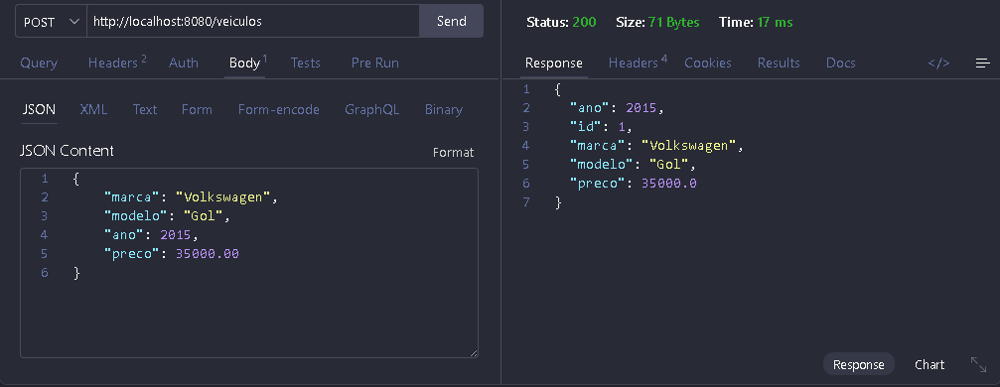
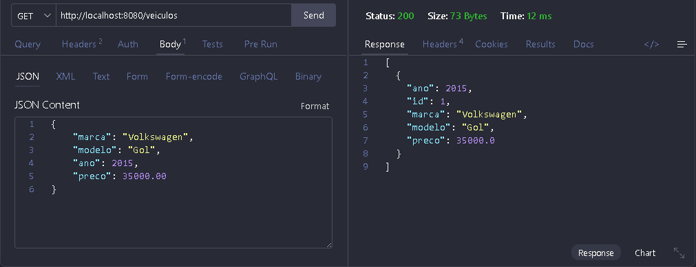
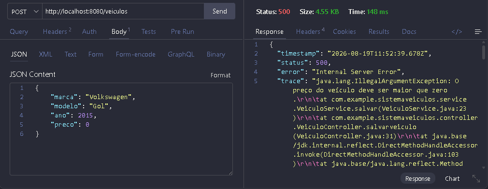
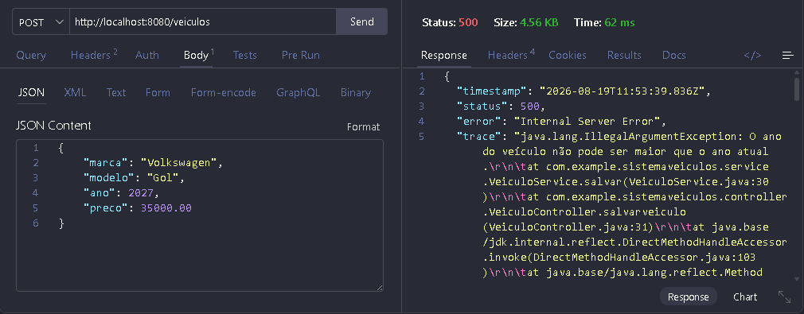

# Sistema de Veículos

API REST desenvolvida em **Java com Spring Boot** para cadastro e consulta de veículos.

## Sobre o projeto

O projeto tem como objetivo aplicar conceitos básicos de desenvolvimento de uma **API REST utilizando Spring Boot**, com organização em camadas:

- Controller
- Service
- Repository
- Model

Os dados dos veículos são armazenados temporariamente em memória utilizando uma `List`, sem utilização de banco de dados.

---

## Tecnologias utilizadas

- **Java 21**
- **Spring Boot**
- **Maven**
- **Spring Web**
- **Visual Studio Code**
- **Thunder Client** para testes da API

---

## Estrutura do projeto

```text
src/main/java/com/example/sistemaveiculos/

├── controller
│   └── VeiculoController.java
│
├── model
│   └── Veiculo.java
│
├── repository
│   └── VeiculoRepository.java
│
└── service
    └── VeiculoService.java
```

### Model

A classe `Veiculo` representa os veículos cadastrados no sistema.

Possui os seguintes atributos:

- `id`
- `marca`
- `modelo`
- `ano`
- `preco`

### Controller

O `VeiculoController` é responsável por receber e responder às requisições HTTP da API.

### Service

O `VeiculoService` concentra as operações e regras de negócio do sistema.

Atualmente existem as seguintes validações:

- O preço do veículo deve ser maior que zero.
- O ano do veículo não pode ser maior que o ano atual.

### Repository

O `VeiculoRepository` é responsável pelo armazenamento e consulta dos veículos em uma lista em memória.

---

## Como executar o projeto

### Pré-requisitos

Para executar o projeto, é necessário ter instalado:

- Java 21
- Maven

### Executando a aplicação

Clone o repositório:

```bash
git clone https://github.com/MarcusMikael/sistema-veiculos.git
```

Entre na pasta do projeto:

```bash
cd sistema-veiculos
```

Execute a aplicação utilizando o Maven Wrapper:

```bash
./mvnw spring-boot:run
```

Após a inicialização, a aplicação estará disponível em:

```bash
http://localhost:8080
```

## Endpoints

### Cadastrar veículo

**POST /veiculos**

Cadastra um novo veículo no sistema.

URL:

```bash
http://localhost:8080/veiculos
```

Body:

```json
{
    "marca": "Volkswagen",
    "modelo": "Gol",
    "ano": 2015,
    "preco": 35000.00
}
```

Resposta:

```json
{
    "id": 1,
    "marca": "Volkswagen",
    "modelo": "Gol",
    "ano": 2015,
    "preco": 35000.0
}
```

### Listar veículos

**GET /veiculos**

Retorna todos os veículos cadastrados.

URL:

```bash
http://localhost:8080/veiculos
```

Resposta:

```json
[
    {
        "id": 1,
        "marca": "Volkswagen",
        "modelo": "Gol",
        "ano": 2015,
        "preco": 35000.0
    }
]
```

## Regras de negócio

O sistema possui algumas validações para o cadastro de veículos.

### Preço

O preço deve ser maior que zero.

Exemplo inválido:

```json
{
    "marca": "Toyota",
    "modelo": "Corolla",
    "ano": 2022,
    "preco": 0
}
```

### Ano

O ano do veículo não pode ser maior que o ano atual.

Exemplo inválido:

```json
{
    "marca": "Toyota",
    "modelo": "Corolla",
    "ano": 2030,
    "preco": 95000
}
```

### Testes

Os endpoints foram testados utilizando o Thunder Client no Visual Studio Code.

Foram realizados testes de:

Cadastro de veículos utilizando POST /veiculos
Consulta de veículos utilizando GET /veiculos
Validação de preço
Validação de ano

## Demostração

**Cadastro de veículos**


**Listagem de veículos**


**Validação de preço**


**Validação de ano**


## Observações

Este projeto utiliza armazenamento em memória para manter a implementação simples e focada nos conceitos básicos de desenvolvimento Back-End com Spring Boot.

Não foram utilizados:

Banco de dados
Autenticação
Front-end
Docker
Deploy

## Desevolvido por

**Marcus Mikael Rodrigues Vieira**